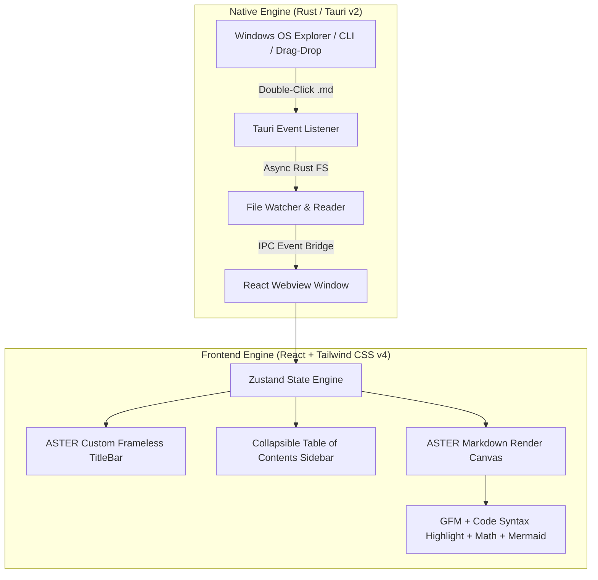

# Project ASTER MD — High-Performance Native Markdown Viewer Architecture

## Executive Summary
**ASTER MD** (from *Aster* / Celestial Star) is an ultra-lightweight, blazing-fast, desktop Markdown viewer built for Windows 11 using **Tauri v2 (Rust)** and a **React + Tailwind CSS v4** frontend.

ASTER MD is engineered to replace bloated Electron apps, achieving a **~4MB installer size**, **<30MB RAM footprint**, and **<300ms instant cold-start**.

---

## Master Architecture & Technical Stack



### Core Tech Stack
- **Core Native Layer**: Tauri v2 (Rust 2021 edition)
- **Frontend Framework**: React 18 + TypeScript + Vite 5
- **Design System & Aesthetics**: Tailwind CSS v4 + `@tailwindcss/typography` (Cosmic Dark Glassmorphism)
- **State Store**: Zustand (lightweight UI & tab state)
- **Markdown & Render Engine**: `react-markdown` + `remark-gfm` + `rehype-highlight` + `rehype-katex` + `mermaid`
- **Iconography & Micro-interactions**: Lucide React + Framer Motion

---

## Core Features of ASTER MD

1. **Celestial Dark Glassmorphism Aesthetic**:
   - Translucent Mica/Acrylic window backdrop with subtle glow highlights.
   - Tailored font stack featuring **Inter** for prose and **JetBrains Mono** for code blocks.
   - Custom frameless title bar with minimize, maximize, pin-on-top, and close controls.

2. **Native OS Integration & Hot File Watching**:
   - Double-click `.md` file opening via OS file association.
   - Drag & Drop file opening directly onto the app surface.
   - Hot file reloader powered by Rust native file watching (`notify` crate).

3. **Rich Document Features**:
   - **GitHub Flavored Markdown (GFM)**: Tables, task checkboxes, strikethroughs.
   - **Code Blocks**: One-click copy code snippet button with visual feedback animation.
   - **Interactive Table of Contents (ToC)**: Sticky sidebar outline with scroll-sync position highlighting.
   - **In-Doc Search**: Instant text search (`Ctrl + F`).
   - **Export Capabilities**: Export rendered document to clean HTML or PDF.

---

## Target Project Directory Structure (`d:\ANTI-GRAVITY\ASTER MD`)

```
ASTER MD/
├── src-tauri/
│   ├── Cargo.toml
│   ├── tauri.conf.json
│   └── src/
│       ├── main.rs
│       └── commands/         # Custom Rust FS & File Watcher commands
├── src/
│   ├── assets/
│   ├── components/
│   │   ├── TitleBar.tsx      # Custom ASTER frameless controls
│   │   ├── Sidebar.tsx       # Collapsible ToC & Recent files
│   │   ├── MarkdownCanvas.tsx# Core Markdown render canvas
│   │   ├── CodeBlock.tsx     # Syntax highlight container + Copy button
│   │   └── SearchBar.tsx     # In-doc search widget
│   ├── store/
│   │   └── useDocStore.ts    # Document state management
│   ├── styles/
│   │   └── globals.css       # Tailwind CSS v4 & glass styling
│   ├── App.tsx
│   └── main.tsx
├── package.json
└── vite.config.ts
```

---

## Implementation Workflow

1. **Phase 1: Project Initialization** — Scaffold Vite + React + TypeScript + Tailwind CSS v4 in `d:\ANTI-GRAVITY\ASTER MD`. Setup Tauri v2 backend configuration.
2. **Phase 2: Rust Backend Engine** — Implement native file reading, file watching, and OS file opening event handlers in Rust.
3. **Phase 3: Cosmic Glass UI & Components** — Build ASTER custom titlebar, ToC sidebar, and Markdown canvas renderer.
4. **Phase 4: Optimization & Production Packaging** — Verify memory footprint (<30MB RAM) and compile executable using `cargo tauri build`.
