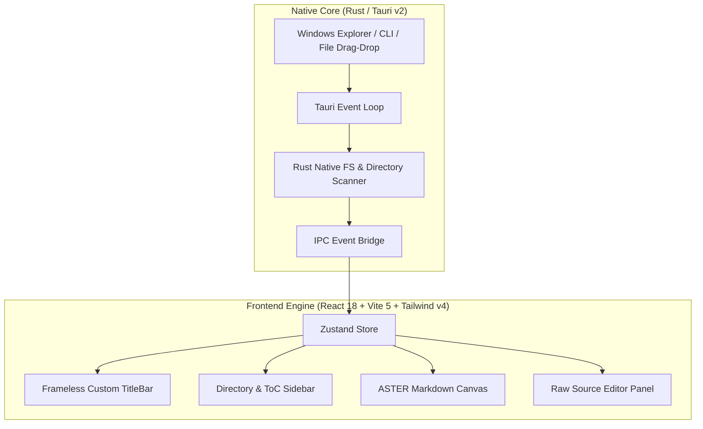

# ASTER MD 🌌

> **Ultra-Lightweight, Blazing-Fast Native Desktop Markdown Viewer for Windows 11**


---

## Executive Overview

**ASTER MD** (from *Aster* / Celestial Star) is a high-performance native desktop Markdown viewer built to replace heavy Electron-based editors. Engineered with **Tauri v2 (Rust)** and a **React 18 + Tailwind CSS v4** frontend, ASTER MD delivers instant cold startup, minimal memory consumption, and a celestial dark glassmorphism aesthetic.

---

## ⚡ Performance Metrics

| Metric | ASTER MD | Standard Electron App |
| :--- | :--- | :--- |
| **Installer Size** | **~3.8 MB** | ~120 MB - 180 MB |
| **RAM Footprint** | **< 30 MB** | ~250 MB - 500 MB |
| **Cold Start Time**| **< 300 ms** | 1.5s - 4.0s |
| **Native I/O** | Rust `std::fs` | Node.js FileSystem |

---

## ✨ Core Features

- 🌌 **Cosmic Glassmorphism UI**: Translucent glass backdrop, dark/light themes, Inter prose typography, and JetBrains Mono code rendering.
- 📁 **Directory Explorer**: Open any folder to automatically list and switch between all `.md` files in seconds.
- 📑 **Interactive ToC Outline**: Sticky sidebar heading outline with smooth-scroll sync.
- ⚡ **50-50 Raw Source Split View**: Side-by-side view comparing live rendered Markdown against raw markdown source.
- 🔄 **Bidirectional Sync Scroll**: Canvas and raw source panels scroll in unison.
- ✍️ **Live Edit Mode & Disk Saving**: Edit Markdown source code live and save directly back to disk (`Ctrl + S`).
- 🧮 **Rich Math & Diagrams**: Native KaTeX mathematical formulas rendering and GitHub Flavored Markdown (GFM) tables & task lists.
- 📋 **Code Snippet Copy**: 1-click copy code snippet container with visual feedback.
- 🔍 **Instant Search**: In-document text search (`Ctrl + F`).
- 📌 **Always-On-Top Pinning**: Keep ASTER MD floating over your active workspace.

---

## 🛠️ Architecture & Tech Stack



### Core Technologies
- **Native Backend**: Tauri v2 (Rust 2021 edition)
- **Frontend Framework**: React 18 + TypeScript + Vite 5
- **Styling**: Tailwind CSS v4 + `@tailwindcss/vite`
- **Markdown Processing**: `react-markdown` + `remark-gfm` + `rehype-highlight` + `rehype-katex`
- **State Store**: Zustand
- **Icons & Animations**: Lucide React + Framer Motion

---

## 🎹 Keyboard Shortcuts

| Shortcut | Action |
| :--- | :--- |
| `Ctrl + O` | Open Markdown File Dialog |
| `Ctrl + B` | Toggle Left Directory / ToC Sidebar |
| `Ctrl + Shift + R` | Toggle 50-50 Raw Source Split View |
| `Ctrl + F` | In-Document Text Search |
| `Ctrl + S` | Save File Changes to Disk |

---

## 🚀 Getting Started & Building

### Prerequisites
- [Node.js](https://nodejs.org/) v18+
- [Rust](https://www.rust-lang.org/) v1.75+
- C++ Build Tools (Windows MSVC)

### Development Setup

```bash
# 1. Clone the repository
git clone https://github.com/ArionGD/ASTER-MD.git
cd ASTER-MD

# 2. Install dependencies
npm install

# 3. Launch Tauri dev application
npx tauri dev
```

### Production Build

```bash
# Compile standalone executable & Windows installers (.exe / .msi)
npx tauri build
```
Output installers are saved to `src-tauri/target/release/bundle/`.

---

## 📄 License

Distributed under the **MIT License**. See `LICENSE` for more information.
